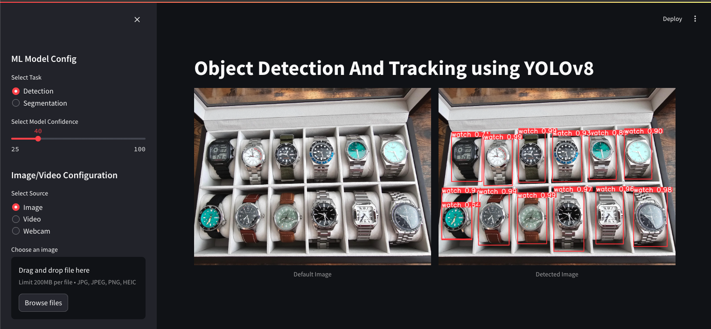

# Object Detection and Tracking using YOLOv8

## Overview

This application performs object detection and tracking using the YOLOv8 model. It is designed to allow users to upload images and videos, or use a webcam, to detect objects in real-time. The app is developed using Streamlit for the front-end interface.



## Features

- **Model Selection:** Users can choose between object detection and segmentation.
- **Confidence Threshold:** Adjustable confidence slider to fine-tune the detection results.
- **Input Sources:** Supports image uploads, video uploads and webcam input.
- **Real-time Object Detection:** Displays detected objects with bounding boxes.

## Requirements

- **Python Packages:**
  - `streamlit`
  - `ultralytics` (YOLOv8)
  - `opencv-python`
  - `Pillow`
- **Local Modules:**
  - `helper`: Contains functions for loading models, processing images/videos/webcam, and displaying detection results.
  - `settings`: Configuration for paths, model settings, and input sources.

## How to Run

1. **Install dependencies** using pip:
   ```sh
   pip install -r requirements.txt
   ```
2. **Run the Streamlit app**:
   ```sh
   streamlit run app.py
   ```

## Contact Information

- **Author:** Lovre Nenadić
- **University:** University of Zadar, Croatia
- **Degree Program:** Bachelor of Engineering in Information Technology (bacc. ing. techn. inf.)
